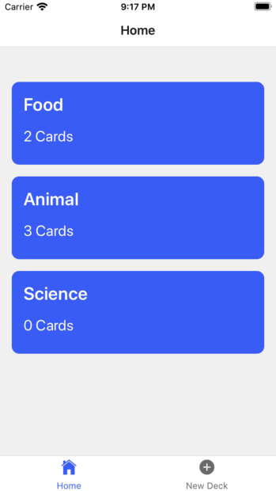

# Mobile Flashcards Project

## Description
The mobile application allows users to study collections of flashcards. The app will allow users to create different categories of flashcards called "decks", add flashcards to those decks, then take quizzes on those decks.

## Platform supported
Mobile flash card has been developed and tested with only iOS. Currently the platform support is only iOS

## Installation
Pre-requisites for the following setup:
* You must have an iPhone mobile or xcode simulator.
* Install expo app from App store for mobile.
For further details of expo setup, refer this link and follow the setup -> https://docs.expo.io/versions/latest/

Steps to get this app working on local.
* Clone the repo: git clone https://github.com/SongJiaojiao/mobile-flashcards.git
* Install prohect dependencies: npm install
* Run server locally: npm start
* Navigate to http://localhost:3000 and see the app running.

## Data

data.js is a fake database that allows you to access the initial data. There is one type of object stored in our database:
1. data

### Data

Users include:

| Attribute    | Type             | Description           |
|-----------------|------------------|-------------------         |
| id                 | String           | the deck's unique identifier |
| title  | String           | The name of the individual deck |
| questions | Array | A list of questions including question, answer and explanations|
| question      | String         | The content of each question |
| answer     | String         | The answer to each question |
| explanation      | String         | Additional explanation to the answer |

Your code will talk to the database via 4 methods:

* `getDecks()`
* `addCardToDeck(deckName,card)`
* `createDeck(deckName)`

1) `_getDecks()` Method

*Description*: Get all of the existing decks from the database.
*Return Value*: Parsed JSON

2) `addCardToDeck(deckName,card)` Method

*Description*: Take in two arguments deckName and card, adds it to the deck matching the deckName and save it in the database
*Return Value*: Parsed Json that contains the following properties: id, title, question and answer. More details about these properties:

| Attribute | Type | Description |
|-----------------|------------------|-------------------|
| author | String | The id of the user who posted the question|
| title| String | The title of the deck |
| questions | Array | A list of questions including question, answer and explanations |
| question      | String         | The content of each question |
| answer     | String         | The answer to each question |
| explanation      | String         | Additional explanation to the answer |

3) `createDeck(deckName)` Method

*Description*: Add a new deck with the title argument passed in the database.
*Parameters*:  Parsed JSON new created and added deck. More details about these properties:

| Attribute | Type | Description |
|-----------------|------------------|-------------------|
| title| String | The title of the deck |
| questions | Array | Empty array |

